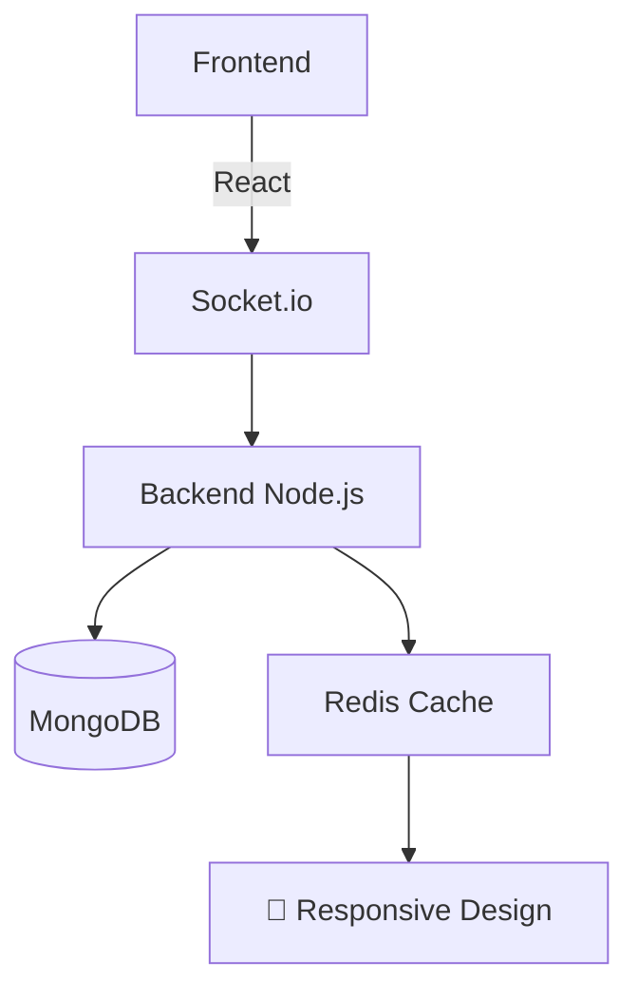

# 🔒 CHAT ANONYME - Messagerie Sécurisée

  
  
  

---

## 🌟 Concept Unique
**Plateforme de discussion complètement anonyme** où chaque utilisateur reçoit un pseudonyme aléatoire. Aucune identification personnelle n'est requise ou stockée.

.

### 🔐 Fonctionnement de l'anonymat
- 🎭 Pseudos générés aléatoirement (ex: "Visiteur8342")
- 🚫 Aucune inscription requise
- 🧹 Historique effacé après déconnexion
- 🔄 Changement d'identité à chaque reconnexion

---

## ✨ Fonctionnalités Clés

  

    <h4>🌐 Discussion en temps réel</h4>
    
Messages instantanés sans refresh

  

  

    <h4>🔄 Rooms temporaires</h4>
    
Salons autodétruits après inactivité

  

  

    <h4>📛 Modération automatique</h4>
    
Filtrage des contenus inappropriés

  

---

## 👥 Créateurs

  <a href="https://github.com/ChanJinhuyk">
    
    
ChanJinhuyk

  </a>
  <a href="https://github.com/kingjr7">
    
    
kingjr7

  </a>

---

## 🛠 Stack Technique

# 1. Cloner le dépôt
git clone https://github.com/ChanJinhuyk/SITE-DE-CHAT.git

# 2. Installer les dépendances
npm install

# 3. Configurer (copier .env.example vers .env)

# 4. Lancer
npm run dev

 
Pour toute collaboration professionnelle :
   

# Politique de Sécurité Juridique

Toute activité suspecte doit être signalée :
- Par email : sasaki-compagnie@mail.com
- (Via WhatsApp) [+242 06 727 4660 ](ChanJinhuyk)  [+242 04 414 8217 ](kingjr7)

Nous utilisons des systèmes de :
- Détection automatique de forks (GitGuardian)
- Watermarking numérique du code
